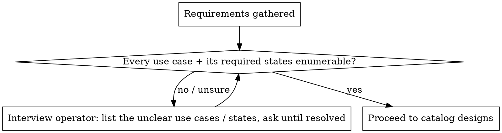

# Design Review

Adversarially **challenge a design against its requirements**: prove that every use case and every UI
**state** the product needs is actually drawn. The deliverable is a gap report, not a thumbs-up.

**Core principle:** A design is incomplete until *each state type* is contemplated somewhere — not just
the happy path. You are hunting for what's *missing* (loading, empty, no-results, error), not admiring
what's present.

**Tool-agnostic by design.** Requirements and designs arrive in whatever form the operator has. Never
require a specific tool. Read designs visually regardless of medium — Figma frames, a rendered HTML page,
PNG/JPG exports, a PDF, or Photoshop artboards. Use whatever MCP/CLI/screenshot capability is available;
if a design can't be read directly, ask the operator to export it to an image.

## The Process

1. **Ingest everything.** Collect all requirement sources and all design artifacts the operator gives.
   Fetch/read each one (use any available tool). Large design boards: enumerate the individual
   screens/frames first, then read each at legible resolution (fan out parallel agents if many).

2. **Extract use cases AND required states.** From the requirements, build the master list of: every
   use case / flow step, and for each, the states it implies. Acceptance criteria are gold — phrases like
   "shown during", "disabled until", "on error", "if empty", "while loading" each name a required state.

3. **Interview until clear — do not proceed on assumptions.** If any use case, flow, or required state is
   ambiguous or missing from the requirements, interview the operator until *all* are pinned down. This
   gate is mandatory (see flowchart). Asking 3 good questions beats auditing against a guessed spec.

4. **Catalog the designs by state.** For each design artifact, identify which flow step and which **state
   type** it depicts (default, loading, empty, no-results-after-filter, error, success/transient,
   disabled, hover/focus, modal). Read the actual text — don't assume from a thumbnail.

5. **Build the coverage matrix.** Map each required (use case × state type) to a design. Anything with no
   matching artifact is a gap. See `references/state-checklist.md` for the full state-type checklist.

6. **Report gaps + discrepancies.** Output the report (see `references/report-template.md`). Distinguish
   *missing states* (no design) from *discrepancies* (design contradicts the spec — wrong values, wrong
   defaults, diverged model). Point to *where* each gap belongs (deep link / frame name / page).

## The Interview Gate (mandatory)

## The Bar (what "complete" means)

You do **not** need every variant (e.g. every possible error message). You **do** need **at least one
example of each state type** that the use cases require. All state types must be contemplated.

→ Full checklist of state types to verify per screen/component: `references/state-checklist.md`

## Output

Default deliverable: a Markdown gap report. Offer an HTML version for easier reading if the operator wants
it. Group gaps by state type, give each a stable ID, cite the source requirement, and link to where it
belongs. → `references/report-template.md`

## Common Mistakes

- **Confirming the happy path** instead of hunting for missing states. The job is adversarial.
- **Skipping the interview** and auditing against a guessed spec. If it's unclear, ask.
- **Judging from thumbnails.** Read the real text/values in each artifact.
- **Tool lock-in.** Don't assume Figma. Handle HTML, images, PDF, Photoshop the same way.
- **Listing every error variant.** One example per state type is enough; coverage of *types* is the goal.
- **No "where".** Every gap must say where the new state belongs so design can act on it.
